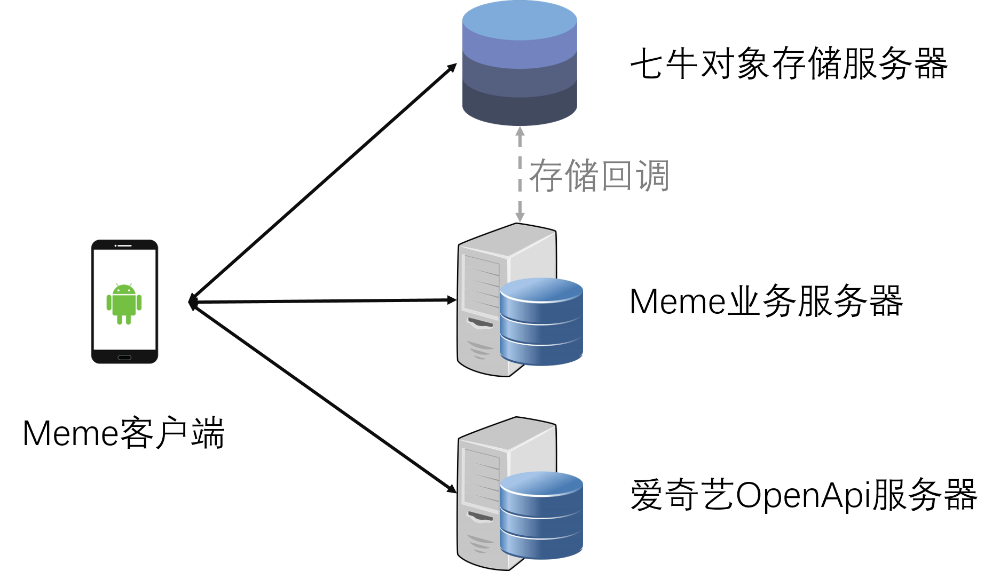
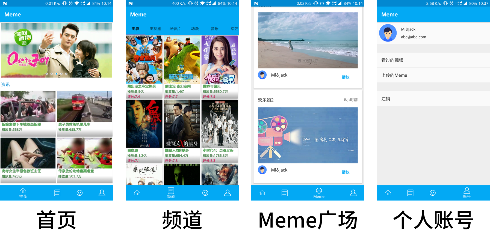
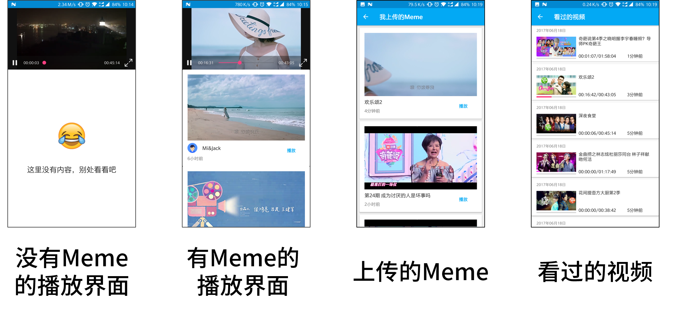
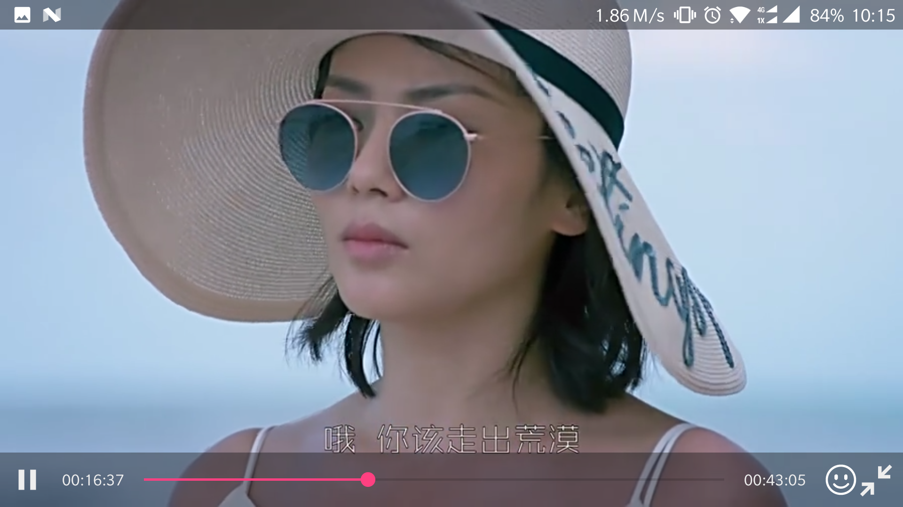
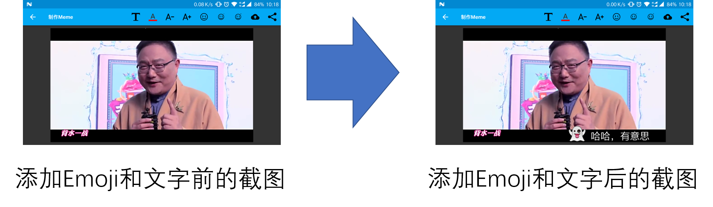
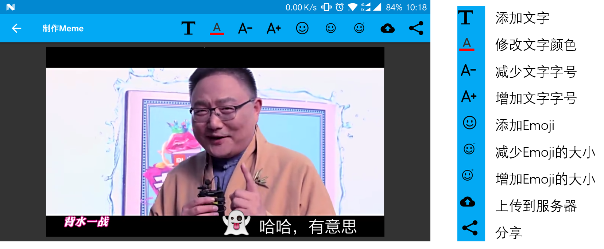
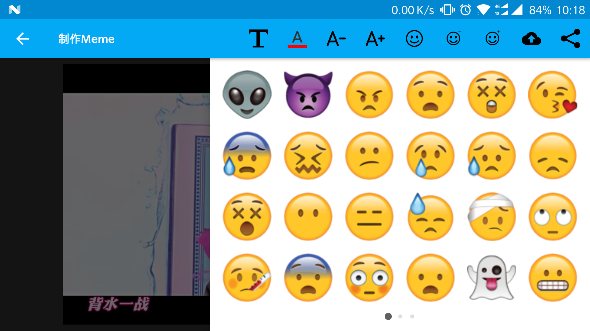

# Meme（持续开发中）

## 项目介绍

Meme这个词最初源自英国著名科学家理查德•道金斯（Richard Dawkins）所著的《自私的基因》 （The Selfish Gene）一书，其含义是指“在诸如语言、观念、信仰、行为方式等的传递过程中与基因在生物进化过程中所起的作用相类似的那个东西。”。在生活中，Meme有好多表现形式，例如含有意义的视频截图等。

我们的应用除了常规的视频播放功能，用户还可以在视频截图中添加Emoji表情和文字从而实现Meme的制作。

## 基本框架

本应用除了使用了爱奇艺提供的OpenApi接口，还搭建了对应的业务服务器，使用七牛云存储存储用户上传的截图，基本架构如下图所示:

## 使用到的技术

###  客户端
在Android客户端，我们是使用以下开源技术辅助开发
- Android Support Library

- [Android Architecture Components](https://developer.android.com/topic/libraries/architecture/index.html)（使用Architecture组件帮助简化框架的开发 ）

- RxJava2

- retrofit2

- glide

### 服务端（Meme业务服务器）
服务端的开发框架为Spring-boot，数据库存储为mysql，图片的存储服务采用的七牛云服务。
## 应用截图

应用的4大Tab页

全屏播放界面

点击上图中下方的笑脸，即可进入`制作Meme`的界面（如下图）

相关的操作指南如下：

我们还提供了丰富的Emoji表情。

## 相关测试账号

用户名：Mi&Jack

邮箱：abc@abc.com 

密码： 111111

## SDK版本说明

由于QiyiVideoView是与SurfaceView实现的，开发过程中没有找到在Android 5.0一下针对SurfaceView的通用截图方案，这里我们采用的是[MediaProjection](https://developer.android.com/reference/android/media/projection/MediaProjection.html) ，而该api是在Android 5.0(Api 21)引入的，为此，本应用不能在Android 5.0 以下的手机上运行。

### 开发测试环境

手机型号：一加3
手机版本： OxygenOS(Android 7.1.1)
